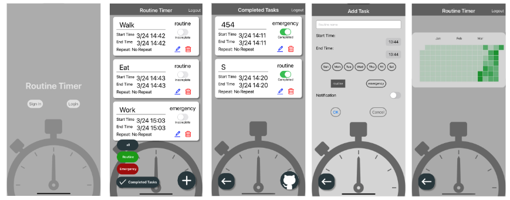
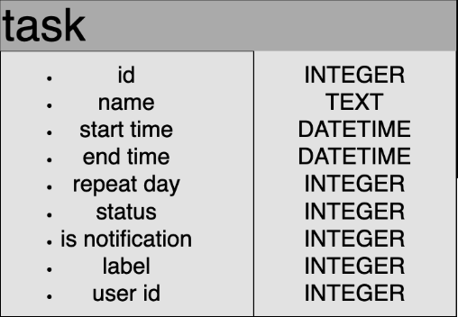

# TaskHub - Task Management App Using React Native in Su pporters Hackathon

## Overview
TaskHub is a task management app created during a Supporters hackathon. It was developed as an experience to explore React Native for the first time. TaskHub combines a routine timer and a todo app to help users fully commit to tasks without depleting memory or attention in their busy daily lives.

<p align="center"> 
     
</p>

## Background and Problem Statement
Using traditional management apps, routine timers only display routine names, requiring separate access to check task details. Additionally, inadequate time setting and notification features, along with the separate existence of routine timers and todo apps, lead to the ambiguity of task locations. To address these issues, we decided to create a sustainable todo app ourselves.

## Technologies Used

- User Authentication: Firebase
- App Development: Expo, React Native
- Database: Firebase, SQLite

## Data Model

<p align="center"> 
     
</p>

## Key Features

- Provides reminders by sending notifications at the start time of routines.
- Visualizes task completion using the GitHub-like grass method to maintain a sense of achievement.
- Allows users to log in with Google accounts using Firebase for authentication.
- Uses Expo for app processing and Firebase & SQLite as the database to store tasks on smartphones.

## UI Design

The UI design was created using Figma to build a user-friendly interface while exploring new technologies like React and React Native. For more details, please refer to the [Figma design](https://www.figma.com/file/220DKM3zaFIJgmjWb2Pb65/%E3%83%8F%E3%83%83%E3%82%AB%E3%82%BD%E3%83%B32024%2F3-team-library?type=design&node-id=0%3A1&mode=design&t=U55V9Hk1xjbDUn1s-1).

## Getting Started

To start simulating the app, run the following command:

```bash
cd TaskHub
expo start
```

